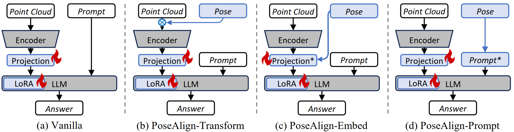

<div align="center">
<h1>Direction-aware 3D Large Multimodal Models</h1>

<a href="https://arxiv.org/abs/2602.19063"></a>
<a href='https://drive.google.com/drive/folders/1g3ExoHlHh8fS-X_XJ1duEiCxfdiBC5sw'></a>
<a href="https://huggingface.co/FL4ST/finetune-3d-llava-lora-PoseAlign-pc-cut03" target="_blank"></a>
<a href="https://huggingface.co/FL4ST/finetune-3d-llava-lora-PoseAlign-pc-top" target="_blank"></a>

[Quan Liu](https://github.com/liuQuan98)<sup>1</sup>, [Weihao Xuan](https://github.com/weihao1115)<sup>2,3</sup>, [Junjue Wang](https://github.com/Junjue-Wang)<sup>2</sup>, [Naoto Yokoya](https://naotoyokoya.com/)<sup>2,3</sup>, [Ling Shao](https://ling-shao.github.io/)<sup>4</sup>, [Shijian Lu](https://personal.ntu.edu.sg/shijian.lu/)<sup>1,&dagger;</sup>

<sup>1</sup>Nanyang Technological University &nbsp; <sup>2</sup>The University of Tokyo &nbsp; <sup>3</sup>RIKEN AIP &nbsp; <sup>4</sup>UCAS-Terminus AI Lab, University of Chinese Academy of Sciences

<sup>&dagger;</sup>Corresponding author

<a href="https://github.com/liuQuan98/PoseAlign3D"></a>

<a href="https://github.com/liuQuan98/PoseAlign3D"></a>
</div>

## Overview

3D large multimodal models (3D LMMs) rely heavily on ego poses for enabling directional question-answering and spatial reasoning. However, most existing point cloud benchmarks contain rich directional queries but lack the corresponding ego poses, making them inherently ill-posed in 3D large multimodal modelling. In this work, we redefine a new and rigorous paradigm that enables direction-aware 3D LMMs by identifying and supplementing ego poses into point cloud benchmarks and transforming the corresponding point cloud data according to the identified ego poses.

We enable direction-aware 3D LMMs with two novel designs:

- **PoseRecover**: A fully automatic pose recovery pipeline that matches questions with ego poses from RGB-D video extrinsics via object-frustum intersection and visibility check with Z-buffers.
- **PoseAlign**: A simple yet effective modifier that transforms the point cloud data to be aligned with the identified ego poses, enabling universal direction-awareness across existing 3D LMMs of different architectures.

Extensive experiments show that our designs yield consistent improvements across multiple 3D LMM backbones such as LL3DA, LL3DA-SONATA, Chat-Scene, and 3D-LLAVA, improving ScanRefer mIoU by 30.0% and Scan2Cap LLM-as-judge accuracy by 11.7%.

## Adapting PoseAlign Benchmark to Your Own Data

[Here](./docs/PoseAlign_Benchmark_Tutorial.md) is a tutorial on how to apply PoseRecover + PoseAlign on your own data.

## Installation

### Training and Evaluation Environment

This codebase is tested on NVIDIA RTX 4090 gpu with CUDA12.1. Please tune the CUDA versions in the script in case you have a differnt CUDA.

```bash
conda create -n 3d-llava-posealign python=3.10 -y
conda activate 3d-llava-posealign
pip install --upgrade pip  # enable PEP 660 support
pip install -e .
pip install -e ".[train]"

pip install flash-attn==2.3.6 --no-build-isolation
pip install git+https://github.com/openai/CLIP.git
pip install spconv-cu120
pip install -U mmengine pycocoevalcap

cd libs/pointops
python setup.py install
cd ../..

conda install -c bioconda google-sparsehash
cd libs/pointgroup_ops
python setup.py install --include_dirs=${CONDA_PREFIX}/include
cd ../..
```

### LLM-as-Judge Environment

```bash
conda deactivate
conda create -n llm-as-judge python=3.10 -y
conda activate llm-as-judge
uv pip install --pre vllm==0.10.2 \
    --extra-index-url https://wheels.vllm.ai/gpt-oss/ \
    --extra-index-url https://download.pytorch.org/whl/nightly/cu128 \
    --index-strategy unsafe-best-match
uv pip install openai-harmony
```

## Data

### Original 3D-LLaVA Data

We conduct experiments with the scans data from ScanNet-v2, as well as the text descriptions from ScanRefer, ScanQA, SQA3D, Scan2Cap, Multi3DRefer. The base training files (processed scannet, train_info, eval_info) are provided by the authors of 3D-LLaVA [in this link](https://huggingface.co/datasets/djiajunustc/3D-LLaVA-Data). These data should be placed in `./playground`.

### Pose Data

You can choose to download our pre-extracted pose files [here](https://drive.google.com/drive/folders/1g3ExoHlHh8fS-X_XJ1duEiCxfdiBC5sw?usp=sharing). The deflated pose files take around 11G of disk space. If you want to extract pose data yourself:

1. Download raw [ScanNet-v2](https://github.com/ScanNet/ScanNet).
2. Extract all pose files:
   ```bash
   cd aux/pose_extraction
   python extract_all_poses.py --dataset_path ${PATH_TO_SCANNET} --output_path ${PATH_TO_POSE_DATA}
   ln -s ${PATH_TO_POSE_DATA} ./playground/poses
   ```

### Miscellaneous Data

Download `matched_ScanQA_v1.0_val.json` and `matched_ScanQA_v1.0_train.json` [here](https://drive.google.com/drive/folders/1g3ExoHlHh8fS-X_XJ1duEiCxfdiBC5sw?usp=sharing) and place them under `playground/data/complementary_info` to make up for the missing `object_id` field in 3D-LLAVA ScanQA data.

### PoseRecover Data

PoseRecover generates view-instance intersection data by matching camera frustums from ScanNet RGB-D sequences with object annotations.

While the PoseRecover script here is deterministic (because we only use segmentation masks for 3D-LLAVA), we also provide the precomputed data [here](https://drive.google.com/drive/folders/1g3ExoHlHh8fS-X_XJ1duEiCxfdiBC5sw?usp=sharing), which should be placed in `./playground/data/view_instance_intersection`.

To generate the data yourself:

```bash
python pose_recover/export_pose_intersections_with_visibility_check.py
```

This computes intersection ratios between all camera poses and object instances for each scene, saving the results to `playground/data/view_instance_intersection/`. These precomputed files are then used during training and evaluation for pose selection.

### Expected Directory Structure

After completing all the data setup above (including PoseRecover), the `./playground` folder should have the following structure:

```
PoseAlign3D  # project root
|-- playground
|   |-- data
|   |   |-- scannet
|   |   |   |-- super_points
|   |   |   |-- train
|   |   |   |-- val
|   |   |   |-- scannet_axis_align_matrix_trainval.pkl
|   |   |-- train_info
|   |   |   |-- scanqa_train_3d_llava.json
|   |   |   |-- sqa3d_train_3d_llava.json
|   |   |   |-- scan2cap_train_3d_llava.json
|   |   |   |-- scanrefer_train_3d_llava.json
|   |   |   |-- multi3drefer_train_3d_llava.json
|   |   |   |-- nr3d_train_3d_llava.json
|   |   |   |-- nr3d_caption_train_3d_llava.json
|   |   |   |-- ...
|   |   |-- eval_info
|   |   |   |-- scanqa
|   |   |   |-- sqa3d
|   |   |   |-- densecap_scanrefer
|   |   |   |-- ...
|   |   |-- view_instance_intersection
|   |   |   |-- scene0000_00_view_instance_intersection_with_visibility.npz
|   |   |   |-- ...
|   |   |-- complementary_info
|   |   |   |-- matched_ScanQA_v1.0_train.json
|   |-- poses
|   |   |-- scans
|   |   |   |-- scene0000_00
|   |   |   |   |-- pose
|   |   |   |   |   |-- 0.txt
|   |   |   |   |   |-- ...
|   |   |   |-- ...
```

## Training

We exploit LoRA tuning by default, building on the 3D-LLAVA backbone. To train with PoseAlign-Transform (the default and recommended variant):

```bash
./scripts/train/finetune-3d-llava-lora_poseAlign-pc-cut03.sh
```

The key PoseAlign-related training arguments are:

| Argument | Description |
|---|---|
| `--use_cam_instance_intersect` | Enable PoseRecover pose selection |
| `--apply_pose_to_pc` | Enable PoseAlign-Transform (recommended) |
| `--apply_pose_to_prompt` | Enable PoseAlign-Prompt variant |
| `--apply_pose_to_projection` | Enable PoseAlign-Embed variant |
| `--use_top_bottom_cut` | Use Clip pose selection strategy |
| `--cut_ratio` | Clip ratio X (default 0.3) |
| `--use_random_pose` | Use random pose selection (ablation) |

> **Note:** For PoseAlign-Embed (i.e., `*-proj.sh` scripts), the trained projector weights need to be integrated into base weights with `merge_lora_model.py` before performing evaluation.

To train the baseline 3D-LLAVA without PoseAlign:

```bash
./scripts/train/finetune-3d-llava-lora.sh
```

## Evaluation

We provide PoseAlign evaluation scripts with pose-aware inference under `scripts/eval/*/`, e.g.:

```bash
./scripts/eval/scanrefer_scripts/multigpu_eval_scanrefer_poseAlign-pc-cut03.sh
```

## LLM-as-Judge Evaluation

We adopt LLM-as-judge accuracy as a metric for evaluating direction-aware QA and captioning. The judging pipeline supports both local vLLM (GPT-OSS-20B) and OpenAI GPT-5-mini backends.

```bash
# Run in llm-as-judge environment

# Run LLM-as-judge evaluation on all benchmarks (vLLM backend)
bash llm_as_judge/llm_as_judge_scripts/batch_run_all.sh

# Create direction-critical subsets (not recommended to re-run if you want precise reproduction)
bash llm_as_judge/direction_critical_subset_judgement/batch_judge_direction_critical_subset_scanqa.sh
bash llm_as_judge/direction_critical_subset_judgement/batch_judge_direction_critical_subset_scan2cap.sh
bash llm_as_judge/direction_critical_subset_judgement/batch_judge_direction_critical_subset_sqa3d.sh

# Compute subset metrics
bash llm_as_judge/eval_scripts/eval_scanqa_subset.sh
bash llm_as_judge/eval_scripts/eval_scan2cap_subset.sh
```

## Citation

```bibtex
@article{liu2025posealign,
  title={Direction-aware 3D Large Multimodal Models},
  author={Liu, Quan and Xuan, Weihao and Wang, Junjue and Yokoya, Naoto and Shao, Ling and Lu, Shijian},
  year={2025}
}
```

## Acknowledgements

This codebase builds upon [3D-LLAVA](https://github.com/djiajunustc/3D-LLaVA) and inherits components from [LLaVA](https://github.com/haotian-liu/LLaVA), [PonderV2](https://github.com/OpenGVLab/PonderV2), and [OneFormer3d](https://github.com/filaPro/oneformer3d).

This research is supported by Networked Exchange, United Strength for Stronger Partnerships between Japan and ASEAN (NEXUS), a collaboration program between the Agency for Science, Technology and Research (A*STAR), Singapore (Grant No. R2416IR138), and the Japan Science and Technology Agency (JST), Japan (Grant No. JPMJNX25CA).
